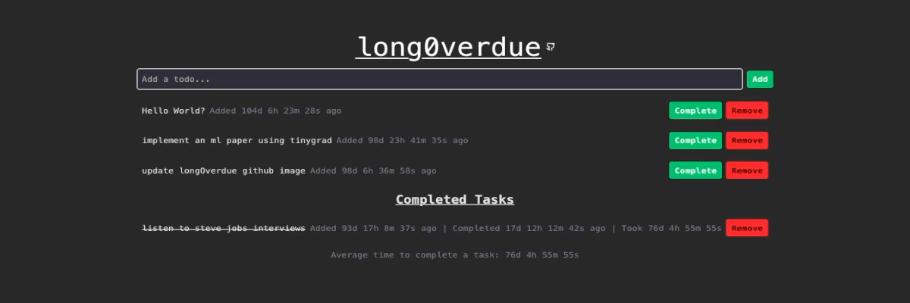

[](https://longoverdue.vercel.app)

# longOverdue

Remember when you said you were going to do that one thing that one time? You even wrote it down, right?

How long has it been though?

With longOverdue, you can keep track of how long its been since you wrote down that one amazing idea.

Excited to announce we are now live and online!

https://longoverdue.vercel.app/

## Features 💡

- Add and delete todos 📝🗑️
- Track the time since each todo was added ⏱️
- Todos are automatically saved to local browser storage 💾

## Deploying locally 🚀

To deploy this application on your own machine, follow these steps:

1. Clone the repository:

```
git clone https://github.com/GangstersPairOfDice/longOverdue.git
```

2. Go inside the directory:

```
cd longOverdue
```

3. Install dependancies:

```
yarn
```

4. Start the development server:

```
yarn dev
```

5. Open your browser and navigate to http://localhost:5173 to view the application.

## Roadmap 📍

- **👤 User Functionality**

  - [x] ➕ Add Todo
  - [x] ➖ Remove Todo
  - [x] ⏳ Time Tracking

    - [x] See how long it's been since a task was added

  - [x] 💾 Save your Todos ( LocalStorage )
  - [x] Complete tasks
    - [x] See completed tasks
    - [x] See what the average time it takes to complete a task
  - [ ] Undo remove button
  - [ ] Notifications ?
  - [ ] Display Customization ? ( display preferences )
  - [ ] Search Function ?
  - [ ] Encryption ?
  - [ ] Collaboration ?

- **😎 Clean UI**

  - [x] Modern and intuitive design
    - [x] Highlight selected task for easy demarcation
  - [x] Easy to navigate and use
  - **📱 Mobile**
    - [x] Test / Update all components to be mobile friendly

- **💻 Hosting**
  - [x] Local/Offline Host
  - [x] Online Host
    - [x] Vercel

## Technologies

- React
- TypeScript
- Tailwind CSS
